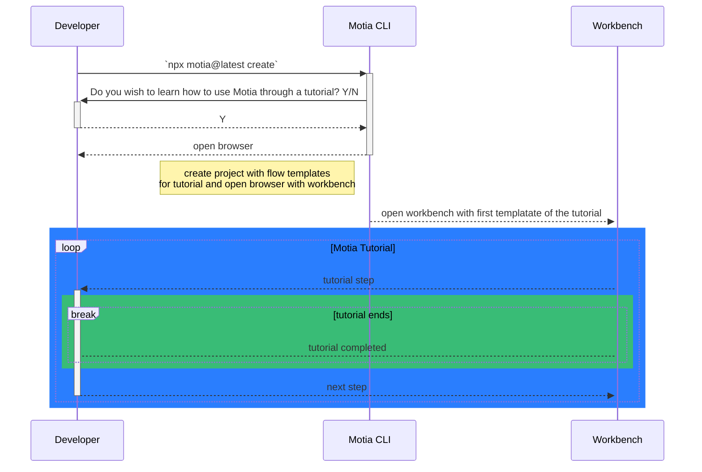
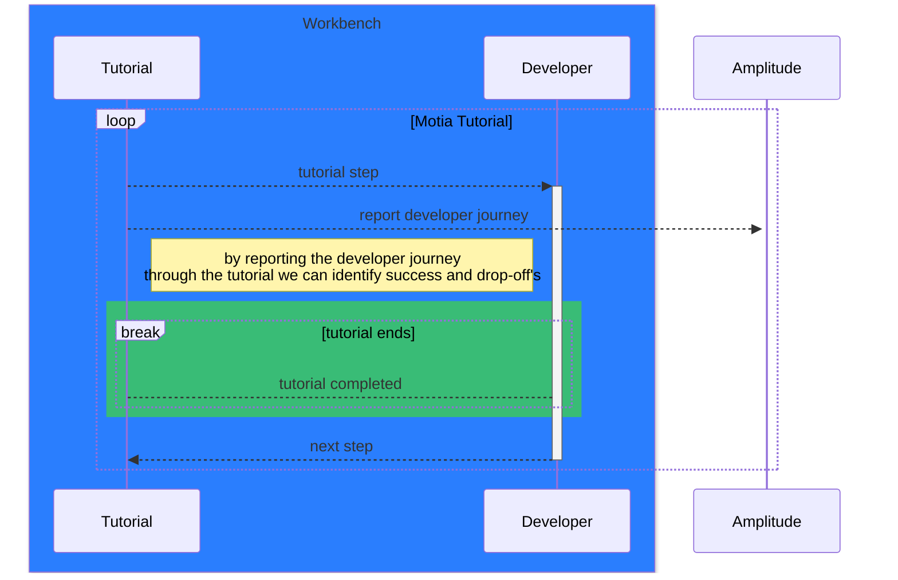
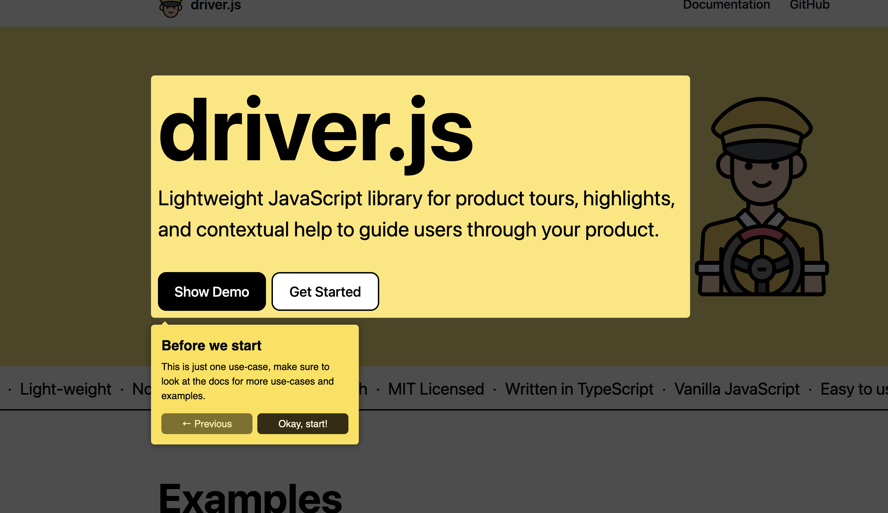

# RFC: Motia Tutorial

<!--
Replace [Feature Name/Title] with a clear, concise title that describes your proposal.
Good examples: "Observability System for Motia Framework", "Multi-tenant Workspace Support"
-->

## Status

- **RFC Date**: 2025-07-31
- **Status**: Draft
- **Authors**: Rodrigo Morales
- **Reviewers**:

## Summary

This RFC proposes creating a tutorial for Motia that will help users understand how to use Motia's ecosystem (framework, workbench, cloud). It is aimed to be supplemental to the existing documentation and provide a more hands-on approach to learning Motia.

## Background

Currently, the learning curve for Motia is high due to the constant evolution of the Motia ecosystem. Most developers come with a background of what they would expect Motia does, depending on the marketing material they have seen and how they associate it to other products.

The main root causes that this RFC addresses are:

- Disarray of the documentation due to the constant evolution of the Motia ecosystem
- Diversity of templates that showcase different use cases of the Motia framework (i.e.: event based parallelism, scheduled tasks, etc...)
- Lack of hands-on examples that help developers understand how to use Motia ecosystem

## Goals

### Primary Goals

1. Create a tutorial that helps users understand how to use Motia ecosystem, provided through the `motia create` cli command
2. Provide a set of templates that showcase different use cases of the Motia framework primitives
3. Make tutorial into segments that can be completed in any desired order
4. Update documentation to direct developers into specific segments of the tutorial

### Secondary Goals

1. Identify documentation gaps and provide a plan to address them

### Non-Goals

- Complex examples that focus on specific solutions (i.e.: workflow to generate and validate legal documents, salesforce integration, etc...)
- Tutorial to use Motia cloud, this would require a terminal, we need to evaluate what would be the bext devex experience for this and would be best suited as a separate initiative (i.e. one click deployment from workbench without the need of a cli)

## Architecture Overview

### High-Level System Architecture



### Data Flow Architecture

> Analytics Data Flow



## Detailed Design

<!--
Dive into the technical details of your proposal.
This section should be comprehensive enough for someone to implement your design.
Break into subsections as needed.
-->

### 1. Data Models

> These type definitions are defined based on the assumption that driver.js will be used to implement the tutorial. These are not final and are subject to change, based on the final library used to implement the tutorial.

```typescript
type TutorialStep = {
  id: string
  title: string
  description?: string
  position: 'left' | 'right' | 'top' | 'bottom'
  elementId: string
  segmentId: string
}

type TutorialSegment = {
  id: string
  title: string
  description?: string
  steps: TutorialStep[]
}

type TutorialConfig = {
  initialSegmentId?: string
  initialStepId?: string
}
```

### 2. SDK Design

The tutorial will be injected into workbench as an SDK (third party plugin), that will orchestrate the tutorial steps and report the developer journey to amplitude. The SDK will be agnostic of Workbench component structure, it will focus on orchestrating the tutorial steps through specific element identifiers.

```typescript
interface MotiaTutorialSDK {
  init: (config?: TutorialConfig) => void
  currentStep: TutorialStep
  currentStepIndex: number
  currentSegment: TutorialSegment
  nextStep: () => void
  previousStep: () => void
  jumpToStep: (stepId: string) => void
  jumpToSegment: (segmentId: string) => void
  abort: () => void
  trackEvent: (event: string, context?: Record<string, unknown>) => void
}
```

### 3. User Interface Changes

The following is an example from driver.js, the final layout would be similar but themed to match Motia's design language.



### 4. Configuration

The tutorial configuration will be maanaged internally, the following configuration can be provided to the SDK:

| Config Name      | Description                                      |
| ---------------- | ------------------------------------------------ |
| initialSegmentId | The id of the segment to start the tutorial from |
| initialStepId    | The id of the step to start the tutorial from    |

The following env variables can be defined to override specific features from the tutorial:

| Env Variable             | Description                                                                                                                                         |
| ------------------------ | --------------------------------------------------------------------------------------------------------------------------------------------------- |
| MOTIA_DISABLE_TUTORIAL   | This will disable the tutorial from being shown, and the tutorial question in the `create` command                                                  |
| MOTIA_ANALYTICS_DISABLED | This will disable the analytics reporting from the tutorial                                                                                         |
| MOTIA_SKIP_TUTORIAL      | This will skip presenting the tutorial to a user if the response is `N` in the `create` command, this will be set as part of the create boilerplate |

## Examples

<!--
Provide concrete examples of how your feature will work.
Use realistic scenarios that users will relate to.
Show input/output examples, code snippets, or UI workflows.
-->

### Example 1: As a developer, I want to start a new motia project and learn how to use the Motia ecosystem

```
> npx motia@latest create
> Do you wish to learn how to use Motia through a tutorial? Y/N
> Y
> ... rest of the create process
> Your project is ready, you will be redirect to Motia Workbench to start the tutorial
```

## Technical Considerations

<!--
Optional: Address important technical aspects that reviewers should consider.
This helps anticipate potential issues and trade-offs.
-->

### Performance Impact

No performace impacts are identified, given that the tutorial will be agnostic of the inner workings of Workbench, it will have dependencies on specific element identifiers to navigate through the UI, but the performance of loading Workbench should not be affected.

Even if the tutorial grows in complexity, given its nature of a step by step guide, it reduces the impact on performance.

### Scalability Considerations

N/A

### Compatibility and Migration

- This will create a depenency between the tutorial and Workbench, changes to the UI in Workbench might require changes to the tutorial
- Changes to the Motia ecosystem will require changes to the tutorial

### Risk Assessment

- Given the constant evolving stage of Motia, the tutorial might need to be updated frequently and it can put additional strains on new feature development, being a potential cause to degrade the quality of the tutorial experience.

## Alternatives Considered

<!--
Optional: Discuss alternative solutions you considered and why you chose this approach.
This demonstrates thorough problem analysis and builds confidence in your solution.
-->

### Alternative 1: Video tutorials

- **Pros**: Controlled visual experience, no dependency on UI changes, no need to navigate through the UI to complete the tutorial
- **Cons**: Easy to ge out of sync and keep up to date with the evolving state of the Motia ecosystem, in some cases it can become expensive, it can be less engaging for some developers that want a hands on experience. lack of control over the content consumption which can conduce to users consuming outdated information.
- **Decision**: This is an add-on for documentation but not a replacement for an interactive tutorial. Better suited to announce new features and provide a high level overview of the Motia ecosystem.

### Alternative 2: Examples

- **Pros**: Diversitry in use cases implemented with Motia that can cast a wide net of developers with different backgrounds (enterprise vs startup, architect vs senior/entry level, etc...)
- **Cons**: Can be overwhelming for new developers, can conduce to quantity over quality, not a hands on experience. Complicated to keep up to date as the list of examples grow.
- **Decision**: This is great as an add-on for developers to share as a community but not a replacement for an interactive tutorial.

## Testing Strategy

<!--
Describe how you plan to test your implementation.
Include unit tests, integration tests, and user acceptance criteria.
-->

### E2E Testing

- Create a playwright test to validate the tutorial flow by segments
- Validate the step by step navigation of the tutorial
- Validate the analytics reporting of the tutorial

### User Acceptance Testing

- Users are able to navigate through the tutorial and learn about the motia ecosystem when starting a new motia project

## Success Metrics

<!--
Define how you'll measure success. Include measurable criteria for both
technical implementation and user/business impact.
-->

- Total number of users that completed the tutorial
- Total number of users that dropped off the tutorial
- Total number of users that started the tutorial
- Total number of users that skipped the tutorial
- Total number of users that dropped off at specific segments
- Total number of users that dropped off at specific steps

### Technical Success

- The tutorial does not corrupt Workbench component structure and behaves as an independent plugin

## Future Considerations

<!--
Optional: Discuss potential future enhancements or related work.
This shows long-term thinking and helps prevent short-sighted designs.
-->

- Integrate Motia Cloud as a segment in the tutorial, we need to find a way to have a one click deploy from Workbench to Motia Cloud

## Questions and Considerations

<!--
Optional: List open questions or areas where you'd like specific feedback.
This helps guide the review process.
-->

- Should we allow users to edit the source code for the tutorial templates from Workbench? This would enhance the tutorial experience by allowing users to type and test code in real time, without leaving the tutorial.
  - We won't proceed with this at the moment since it poses some concerns.

## Conclusion

<!--
Wrap up your RFC with a brief summary of the benefits and next steps.
Reiterate why this proposal is important for Motia and its users.
-->

This proposal is important for Motia and its users (developers) because it will provide a hands-on experience for developers to learn how to use Motia's ecosystem, through a step by step guide that outlines a selection of templates that demonstrate how to use Motia's primitives and tools.
