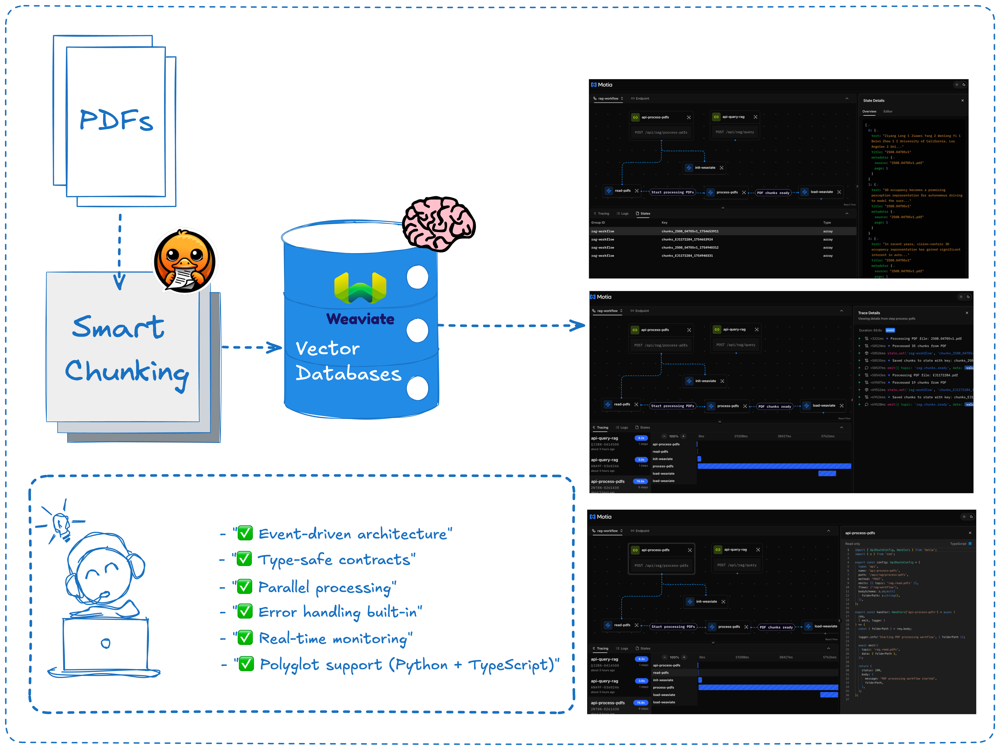

In the era of AI-powered applications, the ability to extract insights from documents is crucial. Whether you're building a knowledge base, a research assistant, or a customer support system, you need to transform static PDFs into queryable, intelligent systems. This is where Retrieval-Augmented Generation (RAG) architecture shines, and where the Motia framework provides an elegant solution.

This comprehensive guide explores how to build a production-ready RAG system that intelligently processes PDFs and answers questions about their content. We'll cover:

1.  **The RAG Architecture**: Understanding how document processing, vector storage, and AI generation work together.
2.  **Motia's Event-Driven Approach**: How `steps` create a scalable, maintainable RAG pipeline.
3.  **Building the Workflow**: A detailed walkthrough of our polyglot processing pipeline.
4.  **Advanced Features**: Real-time progress tracking, error handling, and production considerations.
5.  **Hands-On Testing**: How to ingest documents and query your knowledge base.

Let's transform your documents into an intelligent AI assistant.

---

## The Power of Intelligent Document Processing

<div className="my-8"></div>


At its core, our RAG agent solves a fundamental challenge: how do you make unstructured documents searchable and queryable by AI? Traditional approaches often involve complex, monolithic systems that are difficult to scale and maintain. Our Motia-powered solution breaks this down into discrete, event-driven steps that each handle a specific aspect of the pipeline.

The magic happens through the integration of three powerful technologies:

-   **[Docling](https://github.com/docling-project/docling)**: Advanced PDF parsing with intelligent chunking that preserves document structure
-   **[Weaviate](https://weaviate.io/)**: Cloud-native vector database with built-in OpenAI integration
-   **[Motia](https://motia.dev)**: Event-driven framework that orchestrates the entire pipeline

Instead of a brittle, tightly-coupled system, we get a resilient architecture where each component can be scaled, modified, or replaced independently.

---

## The Anatomy of Our RAG Pipeline

Our application consists of seven specialized steps, each handling a specific part of the document processing and querying workflow. Let's explore the complete architecture.

<Folder name="steps" defaultOpen>
  <Folder name="api-steps" defaultOpen>
    <File name="api-process-pdfs.step.ts" />
    <File name="api-query-rag.step.ts" />
  </Folder>
  <Folder name="event-steps" defaultOpen>
    <File name="init-weaviate.step.ts" />
    <File name="read-pdfs.step.ts" />
    <File name="process-pdfs.step.py" />
    <File name="load-weaviate.step.ts" />
  </Folder>
</Folder>

<Tabs items={['api-process-pdfs', 'init-weaviate', 'read-pdfs', 'process-pdfs', 'load-weaviate', 'api-query-rag']}>
  <Tab value="api-process-pdfs">
    The entry point for document ingestion. This API endpoint receives a folder path, kicks off the processing pipeline, and returns immediately with a tracking ID for real-time progress monitoring.

    ```ts
    import { Handlers } from 'motia'
    import { z } from 'zod'
    import { v4 as uuidv4 } from 'uuid'

    export const config = {
      type: 'api',
      name: 'api-process-pdfs',
      description: 'API endpoint to start PDF processing pipeline',
      path: '/api/rag/process-pdfs',
      method: 'POST',
      emits: ['rag.read.pdfs'],
      bodySchema: z.object({
        folderPath: z.string().min(1, 'folderPath is required'),
      }),
      flows: ['rag-workflow'],
    } as const

    export const handler: Handlers['api-process-pdfs'] = async (req, { emit, logger }) => {
      const { folderPath } = req.body
      const streamId = uuidv4()

      logger.info('Starting PDF processing pipeline', { folderPath, streamId })

      // Emit event to start the processing chain
      await emit({
        topic: 'rag.read.pdfs',
        data: { folderPath, streamId },
      })

      return {
        status: 200,
        body: { 
          message: 'PDF processing started',
          streamId,
          status: 'processing'
        },
      }
    }
    ```

  </Tab>
  <Tab value="init-weaviate">
    Ensures the Weaviate vector database is properly configured with the correct schema for our documents. This step creates the "Books" collection with OpenAI embeddings and GPT-4o generation capabilities.

    ```ts
    import weaviate, { WeaviateClient, vectorizer, generative } from 'weaviate-client'
    import { EventConfig, Handlers } from 'motia'
    import { z } from 'zod'

    export const config: EventConfig = {
      type: 'event',
      name: 'init-weaviate',
      subscribes: ['rag.read.pdfs'],
      emits: [],
      flows: ['rag-workflow'],
      input: z.object({
        folderPath: z.string(),
        streamId: z.string().optional(),
      }),
    }

    const WEAVIATE_SCHEMA = {
      name: 'Books',
      description: 'Document chunks with metadata',
      vectorizers: vectorizer.text2VecOpenAI({
        model: 'text-embedding-3-small',
        sourceProperties: ['text'],
      }),
      generative: generative.openAI({
        model: 'gpt-4o',
        maxTokens: 4096,
      }),
      properties: [
        { name: 'text', dataType: 'text' as const },
        { name: 'title', dataType: 'text' as const },
        { name: 'source', dataType: 'text' as const },
        { name: 'page', dataType: 'number' as const },
      ],
    }

    export const handler: Handlers['init-weaviate'] = async (input, { logger }) => {
      logger.info('Initializing Weaviate client')
      
      const client = await weaviate.connectToWeaviateCloud(process.env.WEAVIATE_URL!, {
        authCredentials: new weaviate.ApiKey(process.env.WEAVIATE_API_KEY!),
        headers: { 'X-OpenAI-Api-Key': process.env.OPENAI_API_KEY! },
      })

      try {
        const exists = await client.collections.get('Books').exists()
        if (!exists) {
          logger.info('Creating Books collection with OpenAI integration...')
          await client.collections.create(WEAVIATE_SCHEMA)
          logger.info('Collection created successfully')
        } else {
          logger.info('Books collection already exists')
        }
      } catch (error) {
        logger.error('Error initializing Weaviate', { error })
        throw error
      } finally {
        await client.close()
      }
    }
    ```

  </Tab>
  <Tab value="read-pdfs">
    Scans the specified folder for PDF files and prepares them for processing. Includes intelligent path resolution to handle various folder structures.

    ```ts
    import { readdir } from 'fs/promises'
    import { join, resolve, basename } from 'path'
    import { EventConfig, Handlers } from 'motia'
    import { z } from 'zod'

    export const config: EventConfig = {
      type: 'event',
      name: 'read-pdfs',
      flows: ['rag-workflow'],
      subscribes: ['rag.read.pdfs'],
      emits: [{ topic: 'rag.process.pdfs', label: 'Start processing PDFs' }],
      input: z.object({
        folderPath: z.string(),
        streamId: z.string().optional(),
      }),
    }

    export const handler: Handlers['read-pdfs'] = async (input, { emit, logger }) => {
      const { folderPath: inputFolderPath, streamId } = input
      logger.info(`Reading PDFs from folder: ${inputFolderPath}`)

      // Intelligent path resolution to prevent ENOENT errors
      const currentDirName = basename(process.cwd())
      let resolvedFolderPath = resolve(inputFolderPath)

      // Handle duplicated path segments
      const duplicatedSegment = `${currentDirName}/${currentDirName}`
      if (resolvedFolderPath.includes(duplicatedSegment)) {
        resolvedFolderPath = resolvedFolderPath.replace(duplicatedSegment, currentDirName)
      }

      logger.info(`Resolved folder path: ${resolvedFolderPath}`)

      try {
        const files = await readdir(resolvedFolderPath)
        const pdfFiles = files.filter((file) => file.endsWith('.pdf'))

        logger.info(`Found ${pdfFiles.length} PDF files`)

        const filesInfo = await Promise.all(
          pdfFiles.map(async (pdfFile) => {
            const filePath = join(resolvedFolderPath, pdfFile)
            return {
              filePath,
              fileName: pdfFile,
            }
          })
        )

        await emit({
          topic: 'rag.process.pdfs',
          data: { files: filesInfo, streamId },
        })
      } catch (error) {
        logger.error(`Failed to read PDFs from folder: ${resolvedFolderPath}`, { error })
        throw error
      }
    }
    ```

  </Tab>
  <Tab value="process-pdfs">
    The heart of our document processing pipeline. This Python step uses Docling to intelligently parse and chunk PDFs, preserving document structure and context.

    ```python
    import json
    import os
    from pathlib import Path
    from typing import Any, Dict, List
    from docling.document_converter import DocumentConverter
    from docling.chunking import HybridChunker
    from docling.datamodel.base_models import InputFormat
    from docling.datamodel.pipeline_options import PdfPipelineOptions
    from docling.document_converter import PdfFormatOption

    def handler(input_data: Dict[str, Any], context: Dict[str, Any]) -> None:
        """Process PDFs using Docling with intelligent chunking"""
        logger = context['logger']
        emit = context['emit']
        
        files = input_data.get('files', [])
        stream_id = input_data.get('streamId')
        
        logger.info(f"Processing {len(files)} PDF files with Docling")
        
        # Configure Docling with optimized settings
        pipeline_options = PdfPipelineOptions(
            do_ocr=True,
            do_table_structure=True,
            table_structure_options={
                "do_cell_matching": True,
            }
        )
        
        doc_converter = DocumentConverter(
            format_options={
                InputFormat.PDF: PdfFormatOption(pipeline_options=pipeline_options)
            }
        )
        
        # Initialize the hybrid chunker for intelligent document segmentation
        chunker = HybridChunker(
            tokenizer="cl100k_base",
            max_tokens=512,
            overlap_tokens=50,
            heading_hierarchies=True,
            split_by_page=False
        )
        
        all_chunks = []
        
        for file_info in files:
            file_path = file_info['filePath']
            file_name = file_info['fileName']
            
            logger.info(f"Processing file: {file_name}")
            
            try:
                # Convert PDF to structured document
                result = doc_converter.convert(file_path)
                doc = result.document
                
                logger.info(f"Converted {file_name}: {len(doc.pages)} pages")
                
                # Apply intelligent chunking
                chunks = list(chunker.chunk(doc))
                logger.info(f"Generated {len(chunks)} chunks for {file_name}")
                
                # Prepare chunks for Weaviate
                for i, chunk in enumerate(chunks):
                    chunk_data = {
                        'text': chunk.text,
                        'title': file_name,
                        'source': file_path,
                        'page': getattr(chunk, 'page_no', i + 1),
                        'chunk_id': f"{file_name}_chunk_{i}"
                    }
                    all_chunks.append(chunk_data)
                    
            except Exception as e:
                logger.error(f"Error processing {file_name}: {str(e)}")
                continue
        
        logger.info(f"Total chunks generated: {len(all_chunks)}")
        
        if all_chunks:
            # Emit chunks for Weaviate ingestion
            emit({
                'topic': 'rag.load.weaviate',
                'data': {
                    'chunks': all_chunks,
                    'streamId': stream_id,
                    'totalFiles': len(files),
                    'totalChunks': len(all_chunks)
                }
            })
        else:
            logger.warning("No chunks generated from PDF processing")
    ```

  </Tab>
  <Tab value="load-weaviate">
    Efficiently batches and loads the processed document chunks into Weaviate with progress tracking and error handling.

    ```ts
    import weaviate from 'weaviate-client'
    import { EventConfig, Handlers } from 'motia'
    import { z } from 'zod'

    const ChunkSchema = z.object({
      text: z.string(),
      title: z.string(),
      source: z.string(),
      page: z.number(),
      chunk_id: z.string(),
    })

    export const config: EventConfig = {
      type: 'event',
      name: 'load-weaviate',
      subscribes: ['rag.load.weaviate'],
      emits: [],
      flows: ['rag-workflow'],
      input: z.object({
        chunks: z.array(ChunkSchema),
        streamId: z.string().optional(),
        totalFiles: z.number().optional(),
        totalChunks: z.number().optional(),
      }),
    }

    export const handler: Handlers['load-weaviate'] = async (input, { logger }) => {
      const { chunks, streamId, totalFiles, totalChunks } = input
      
      logger.info('Loading chunks into Weaviate', { 
        chunkCount: chunks.length,
        totalFiles,
        totalChunks,
        streamId 
      })

      const client = await weaviate.connectToWeaviateCloud(process.env.WEAVIATE_URL!, {
        authCredentials: new weaviate.ApiKey(process.env.WEAVIATE_API_KEY!),
        headers: { 'X-OpenAI-Api-Key': process.env.OPENAI_API_KEY! },
      })

      try {
        const collection = client.collections.get('Books')
        const BATCH_SIZE = 100

        // Process chunks in batches for optimal performance
        for (let i = 0; i < chunks.length; i += BATCH_SIZE) {
          const batch = chunks.slice(i, i + BATCH_SIZE)
          const batchNumber = Math.floor(i / BATCH_SIZE) + 1
          const totalBatches = Math.ceil(chunks.length / BATCH_SIZE)

          logger.info(`Inserting batch ${batchNumber}/${totalBatches}`, {
            batchSize: batch.length,
            streamId
          })

          const objects = batch.map(chunk => ({
            properties: {
              text: chunk.text,
              title: chunk.title,
              source: chunk.source,
              page: chunk.page,
            }
          }))

          const result = await collection.data.insertMany(objects)
          
          if (result.hasErrors) {
            logger.error('Batch insertion had errors', { 
              errors: result.errors,
              batchNumber,
              streamId 
            })
          } else {
            logger.info(`Successfully inserted batch ${batchNumber}/${totalBatches}`)
          }
        }

        logger.info('Successfully loaded all chunks into Weaviate', {
          totalChunks: chunks.length,
          streamId
        })

      } catch (error) {
        logger.error('Error loading chunks into Weaviate', { error, streamId })
        throw error
      } finally {
        await client.close()
      }
    }
    ```

  </Tab>
  <Tab value="api-query-rag">
    The query interface that performs semantic search and generates contextual answers using Weaviate's integrated OpenAI capabilities.

    ```ts
    import weaviate from 'weaviate-client'
    import { Handlers } from 'motia'
    import { z } from 'zod'

    const RAGResponse = z.object({
      answer: z.string(),
      chunks: z.array(z.object({
        text: z.string(),
        title: z.string(),
        source: z.string(),
        page: z.number(),
      })),
      query: z.string(),
      timestamp: z.string(),
    })

    export const config = {
      type: 'api',
      name: 'api-query-rag',
      description: 'Query the RAG system for answers',
      path: '/api/rag/query',
      method: 'POST',
      emits: [],
      bodySchema: z.object({
        query: z.string().min(1, 'Query is required'),
        limit: z.number().min(1).max(10).default(3),
      }),
      flows: ['rag-workflow'],
    } as const

    export const handler: Handlers['api-query-rag'] = async (req, { logger }) => {
      const { query, limit = 3 } = req.body

      logger.info('Processing RAG query', { query, limit })

      const client = await weaviate.connectToWeaviateCloud(process.env.WEAVIATE_URL!, {
        authCredentials: new weaviate.ApiKey(process.env.WEAVIATE_API_KEY!),
        headers: { 'X-OpenAI-Api-Key': process.env.OPENAI_API_KEY! },
      })

      try {
        const collection = client.collections.get('Books')
        
        // Perform semantic search with AI generation
        const results = await collection.generate.nearText(
          query,
          { limit, distance: 0.6 },
          { 
            singlePrompt: `Answer this question based on the provided context: ${query}. 
                          Be specific and cite the sources when possible.` 
          }
        )

        // Extract the generated answer and source chunks
        const generatedAnswer = results.generated || 'No answer could be generated.'
        
        const chunks = results.objects.map(obj => ({
          text: obj.properties.text as string,
          title: obj.properties.title as string,
          source: obj.properties.source as string,
          page: obj.properties.page as number,
        }))

        const response = RAGResponse.parse({
          answer: generatedAnswer,
          chunks,
          query,
          timestamp: new Date().toISOString(),
        })

        logger.info('RAG query completed successfully', { 
          query, 
          chunksFound: chunks.length,
          answerLength: generatedAnswer.length 
        })

        return {
          status: 200,
          body: response,
        }

      } catch (error) {
        logger.error('Error processing RAG query', { error, query })
        return {
          status: 500,
          body: { error: 'Failed to process query' },
        }
      } finally {
        await client.close()
      }
    }
    ```

  </Tab>
</Tabs>

---

## Explore the Workbench

The Motia Workbench provides a visual representation of your RAG pipeline, making it easy to understand the flow and debug any issues.

<div className="my-8"></div>

You can monitor real-time processing, view logs, and trace the execution of each step directly in the Workbench interface. This makes development and debugging significantly easier compared to traditional monolithic approaches.

---

## Key Features & Benefits

### 🚀 **Event-Driven Architecture**
Each step is independent and communicates through events, making the system highly scalable and maintainable.

### 🧠 **Intelligent Document Processing**  
Docling's hybrid chunking preserves document structure while creating optimal chunks for embedding.

### ⚡ **High-Performance Vector Search**
Weaviate's cloud-native architecture provides fast, scalable similarity search with built-in OpenAI integration.

### 🔄 **Real-Time Progress Tracking**
Monitor document processing progress with detailed logging and status updates.

### 🌐 **Polyglot Support**
Seamlessly combine Python (Docling) and TypeScript (orchestration) in a single workflow.

### 🛡️ **Production-Ready**
Built-in error handling, batch processing, and resource cleanup ensure reliability.

---

## Trying It Out

Ready to build your own intelligent document assistant? Let's get the system running.

<Steps>

### Install Dependencies

Install both Node.js and Python dependencies. The prepare script automatically sets up the Python virtual environment.

```shell
npm install
```

### Set Your Environment Variables

You'll need API keys for OpenAI and Weaviate Cloud. Create a `.env` file:

```shell
OPENAI_API_KEY="sk-..."
WEAVIATE_URL="https://your-cluster.weaviate.network"
WEAVIATE_API_KEY="your-weaviate-api-key"
```

### Run the Project

Start the Motia development server to begin processing documents.

```shell
npm run dev
```

### Process Your First Documents

Add some PDF files to the `docs/pdfs/` folder, then start the ingestion pipeline:

```shell
curl -X POST http://localhost:3000/api/rag/process-pdfs \
  -H "Content-Type: application/json" \
  -d '{"folderPath":"docs/pdfs"}'
```

Watch the logs as your documents are processed through the pipeline:
1. **PDF Reading**: Files are discovered and queued
2. **Docling Processing**: Intelligent chunking with structure preservation  
3. **Weaviate Loading**: Chunks are embedded and stored

### Query Your Knowledge Base

Once processing is complete, you can ask questions about your documents:

#### General Query
```shell
curl -X POST http://localhost:3000/api/rag/query \
  -H "Content-Type: application/json" \
  -d '{"query":"What are the main topics covered in these documents?","limit":3}'
```

#### Specific Question
```shell
curl -X POST http://localhost:3000/api/rag/query \
  -H "Content-Type: application/json" \
  -d '{"query":"What methodology was used in the research?","limit":5}'
```

The response includes both a generated answer and the source chunks with page numbers for verification.

</Steps>

---

## Advanced Usage

### Custom Chunking Strategies

Modify the Python processing step to implement custom chunking logic:

```python
# In process-pdfs.step.py
chunker = HybridChunker(
    tokenizer="cl100k_base",
    max_tokens=1024,  # Larger chunks for more context
    overlap_tokens=100,  # More overlap for better continuity
    heading_hierarchies=True,
    split_by_page=True  # Preserve page boundaries
)
```

### Batch Processing Optimization

Adjust batch sizes in the Weaviate loading step for optimal performance:

```ts
// In load-weaviate.step.ts
const BATCH_SIZE = 50  // Smaller batches for large documents
```

### Multi-Collection Support

Extend the system to handle different document types by creating separate Weaviate collections:

```ts
const COLLECTIONS = {
  research: 'ResearchPapers',
  manuals: 'TechnicalManuals', 
  reports: 'BusinessReports'
}
```

---

## Troubleshooting

### Common Issues

**ENOENT Path Errors**: The system automatically handles path normalization, but ensure your `folderPath` is relative to the project root.

**Empty Answers**: Check that documents were successfully processed by examining the logs. Verify your OpenAI API key is valid.

**Weaviate Connection Issues**: Ensure your `WEAVIATE_URL` and `WEAVIATE_API_KEY` are correct and your cluster is running.

### Performance Tips

- **Document Size**: For large PDFs, consider preprocessing to split them into smaller files
- **Batch Size**: Adjust the Weaviate batch size based on your cluster's capacity
- **Chunking Strategy**: Experiment with different chunk sizes and overlap for your specific use case

---

## 💻 Dive into the Code

Want to explore the complete RAG implementation? Check out the full source code, including all steps, configuration files, and setup instructions:

<div className="not-prose">
  <div className="bg-gradient-to-r from-purple-50 to-pink-50 border border-purple-200 rounded-lg p-6 my-6">
    <div className="flex items-start space-x-4">
      <div className="flex-shrink-0">
        <svg className="w-8 h-8 text-purple-600" fill="currentColor" viewBox="0 0 20 20">
          <path fillRule="evenodd" d="M12.316 3.051a1 1 0 01.633 1.265l-4 12a1 1 0 11-1.898-.632l4-12a1 1 0 011.265-.633zM5.707 6.293a1 1 0 010 1.414L3.414 10l2.293 2.293a1 1 0 11-1.414 1.414l-3-3a1 1 0 010-1.414l3-3a1 1 0 011.414 0zm8.586 0a1 1 0 011.414 0l3 3a1 1 0 010 1.414l-3 3a1 1 0 11-1.414-1.414L16.586 10l-2.293-2.293a1 1 0 010-1.414z" clipRule="evenodd" />
        </svg>
      </div>
      <div className="flex-1">
        <h3 className="text-lg font-semibold text-gray-900 mb-2">Complete RAG Implementation</h3>
        <p className="text-gray-600 mb-4">Access the full source code for this RAG agent, including Python processing scripts, TypeScript orchestration, and production configuration.</p>
        <div className="flex flex-col sm:flex-row gap-3">
          <a 
            href="https://github.com/MotiaDev/motia-examples/tree/main/examples/rag-docling-weaviate-agent" 
            target="_blank" 
            rel="noopener noreferrer"
            className="inline-flex items-center px-4 py-2 bg-purple-600 hover:bg-purple-700 text-white font-medium rounded-md transition-colors duration-200"
          >
            <svg className="w-4 h-4 mr-2" fill="currentColor" viewBox="0 0 24 24">
              <path d="M12 0C5.374 0 0 5.373 0 12 0 17.302 3.438 21.8 8.207 23.387c.599.111.793-.261.793-.577v-2.234c-3.338.726-4.033-1.416-4.033-1.416-.546-1.387-1.333-1.756-1.333-1.756-1.089-.745.083-.729.083-.729 1.205.084 1.839 1.237 1.839 1.237 1.07 1.834 2.807 1.304 3.492.997.107-.775.418-1.305.762-1.604-2.665-.305-5.467-1.334-5.467-5.931 0-1.311.469-2.381 1.236-3.221-.124-.303-.535-1.524.117-3.176 0 0 1.008-.322 3.301 1.23A11.509 11.509 0 0112 5.803c1.02.005 2.047.138 3.006.404 2.291-1.552 3.297-1.23 3.297-1.30.653 1.653.242 2.874.118 3.176.77.84 1.235 1.911 1.235 3.221 0 4.609-2.807 5.624-5.479 5.921.43.372.823 1.102.823 2.222v3.293c0 .319.192.694.801.576C20.566 21.797 24 17.3 24 12c0-6.627-5.373-12-12-12z"/>
            </svg>
            View RAG Example
          </a>
          <a 
            href="https://github.com/MotiaDev/motia-examples" 
            target="_blank" 
            rel="noopener noreferrer"
            className="inline-flex items-center px-4 py-2 bg-gray-100 hover:bg-gray-200 text-gray-800 font-medium rounded-md transition-colors duration-200"
          >
            More Examples →
          </a>
        </div>
      </div>
    </div>
  </div>
</div>

---

## Conclusion: The Future of Document Intelligence

This RAG system demonstrates the power of combining best-in-class technologies with Motia's event-driven architecture. By breaking down complex document processing into discrete, manageable steps, we've created a system that's not only powerful but also maintainable and scalable.

The polyglot nature of the solution: Python for document processing, TypeScript for orchestration, shows how Motia enables you to use the right tool for each job without sacrificing integration or maintainability.

From here, you can extend the system by:
- Adding support for other document formats (Word, PowerPoint, etc.)
- Implementing document classification and routing
- Adding real-time document updates and synchronization
- Building a web interface for document management
- Integrating with existing business systems

The event-driven architecture makes all of these extensions straightforward to implement without disrupting the existing pipeline.

Ready to transform your documents into intelligent, queryable knowledge bases? Start building with Motia today!
