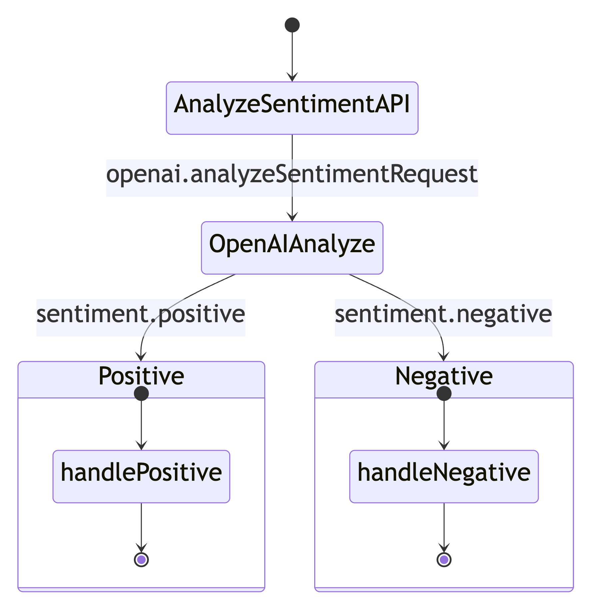
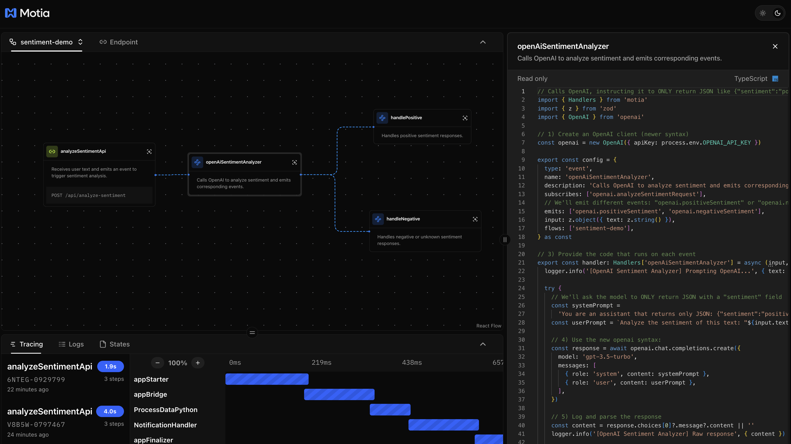
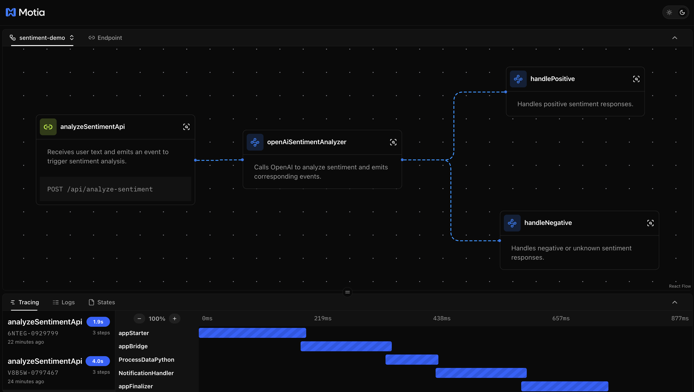

<div className="my-8"></div>

In modern application development, workflows are rarely linear. Whether you're building a simple "prompt => response" system or a complex, multi-stage data processing pipeline, you often need your application to make decisions and route data dynamically. This is where the power of event-driven architecture shines, and where the Motia framework provides a clear path forward.

This guide explores how to build a dynamic sentiment analysis application that uses an LLM to determine how to proceed. We'll cover:

1.  **The Motia Philosophy**: How `steps` as a core primitive simplify complex architectures.
2.  **Building the Workflow**: A step-by-step guide to creating the four key components of our application.
3.  **Visualizing the Flow**: How events chain together to create a cohesive, dynamic system.
4.  **Hands-On with the API**: How to run and test your new sentiment analyzer.

Let's dive in.

---

## A Step at a Time

<div className="my-8"></div>

At the heart of the Motia framework is a simple but powerful idea: the **`step`**. A step is a self-contained, independent unit of logic that listens for an event, performs a task, and, optionally, emits a new event. This concept is the core primitive that allows you to break down even the most complex architectures into a series of simple, manageable components.

Instead of a monolithic application where business logic is tightly coupled, Motia encourages a decoupled, event-driven approach. This has several key advantages:

-   **Clarity**: Each step has a single responsibility, making the application easier to understand and reason about.
-   **Scalability**: Steps can be scaled independently, so you can allocate resources where they're needed most.
-   **Extensibility**: Adding new functionality is as simple as creating a new step and subscribing it to an existing event.
-   **Resilience**: The decoupled nature of steps means that a failure in one part of the system doesn't necessarily bring down the entire application.

In this project, we'll see this philosophy in action as we build a sentiment analyzer with four distinct steps, each with its own clear purpose.

---

## The Anatomy of Our Sentiment Analyzer

Our application will be composed of four steps. Let's explore each one.

<Folder name="steps" defaultOpen>
  <File name="analyzeSentimentApi.step.ts" />
  <File name="openAiAnalyzeSentiment.step.ts" />
  <File name="handlePositive.step.ts" />
  <File name="handleNegative.step.ts" />
</Folder>

<Tabs items={['analyzeSentimentApi', 'openAiAnalyzeSentiment', 'handlePositive', 'handleNegative']}>
  <Tab value="analyzeSentimentApi">
    This is the entry point to our workflow. It's an API step that listens for `POST` requests, validates the incoming data, and emits an `openai.analyzeSentimentRequest` event.

    ```ts
    // Receives user text, emits "openai.analyzeSentimentRequest".
    import { Handlers } from 'motia'
    import { z } from 'zod'

    export const config = {
      type: 'api',
      name: 'analyzeSentimentApi',
      description: 'Receives user text and emits an event to trigger sentiment analysis.',
      path: '/api/analyze-sentiment',
      method: 'POST',
      emits: ['openai.analyzeSentimentRequest'],
      bodySchema: z.object({
        text: z.string().min(1, 'text is required'),
      }),
      flows: ['sentiment-demo'],
    } as const

    export const handler: Handlers['analyzeSentimentApi'] = async (req, { emit, logger }) => {
      const { text } = req.body

      logger.info('[AnalyzeSentimentAPI] Received text', { text })

      // Emit an event to call OpenAI
      await emit({
        topic: 'openai.analyzeSentimentRequest',
        data: { text },
      })

      // Return right away
      return {
        status: 200,
        body: { status: 'Accepted', message: 'Your text is being analyzed' },
      }
    }
    ```

  </Tab>
  <Tab value="openAiAnalyzeSentiment">
    This step is the brains of our operation. It subscribes to the `openai.analyzeSentimentRequest` event, calls the OpenAI API, and then based on the response, emits either a `openai.positiveSentiment` or `openai.negativeSentiment` event. This is where the dynamic routing happens.

    ```ts
    // Calls OpenAI, instructing it to ONLY return JSON like {"sentiment":"positive","analysis":"..."}
    import { Handlers } from 'motia'
    import { z } from 'zod'
    import { OpenAI } from 'openai'

    // 1) Create an OpenAI client (newer syntax)
    const openai = new OpenAI({ apiKey: process.env.OPENAI_API_KEY })

    export const config = {
      type: 'event',
      name: 'openAiSentimentAnalyzer',
      description: 'Calls OpenAI to analyze sentiment and emits corresponding events.',
      subscribes: ['openai.analyzeSentimentRequest'],
      // We'll emit different events: "openai.positiveSentiment" or "openai.negativeSentiment"
      emits: ['openai.positiveSentiment', 'openai.negativeSentiment'],
      input: z.object({ text: z.string() }),
      flows: ['sentiment-demo'],
    } as const

    // 3) Provide the code that runs on each event
    export const handler: Handlers['openAiSentimentAnalyzer'] = async (input, { emit, logger }) => {
      logger.info('[OpenAI Sentiment Analyzer] Prompting OpenAI...', { text: input.text })

      try {
        // We'll ask the model to ONLY return JSON with a "sentiment" field
        const systemPrompt =
          'You are an assistant that returns only JSON: {"sentiment":"positive|negative","analysis":"..."}'
        const userPrompt = `Analyze the sentiment of this text: "${input.text}". Return JSON with keys "sentiment" and "analysis".`

        // 4) Use the new openai syntax:
        const response = await openai.chat.completions.create({
          model: 'gpt-3.5-turbo',
          messages: [
            { role: 'system', content: systemPrompt },
            { role: 'user', content: userPrompt },
          ],
        })

        // 5) Log and parse the response
        const content = response.choices[0]?.message?.content || ''
        logger.info('[OpenAI Sentiment Analyzer] Raw response', { content })

        let parsed: { sentiment?: string; analysis?: string } = {}
        try {
          parsed = JSON.parse(content.trim())
        } catch (err) {
          logger.error('[OpenAI Sentiment Analyzer] Unable to parse JSON', { error: err })
          // If it's not JSON, we bail or handle differently
          return
        }

        // 6) Decide how to route the event
        if (parsed.sentiment) {
          if (parsed.sentiment.toLowerCase() === 'positive') {
            await emit({
              topic: 'openai.positiveSentiment',
              data: { ...parsed, sentiment: parsed.sentiment },
            })
          } else {
            // default to negative
            await emit({
              topic: 'openai.negativeSentiment',
              data: { ...parsed, sentiment: parsed.sentiment },
            })
          }
        } else {
          logger.error('[OpenAI Sentiment Analyzer] Sentiment is missing from the parsed response', { parsed })
        }
      } catch (err) {
        if (err instanceof Error) {
          logger.error('[OpenAI Sentiment Analyzer] Error calling OpenAI', { error: err.message })
        } else {
          logger.error('[OpenAI Sentiment Analyzer] An unknown error occurred while calling OpenAI', { error: err })
        }
      }
    }
    ```
  </Tab>
  <Tab value="handlePositive">
    A specialized responder that listens for the `openai.positiveSentiment` event and logs a confirmation message. In a real-world application, this could trigger a Slack notification, send an email, or kick off another workflow.

    ```ts
    // Handles "openai.positiveSentiment"
    import { Handlers } from 'motia'
    import { z } from 'zod'

    export const config = {
      type: 'event',
      name: 'handlePositive',
      description: 'Handles positive sentiment responses.',
      subscribes: ['openai.positiveSentiment'],
      emits: [],
      input: z.object({
        sentiment: z.string(),
        analysis: z.string().optional(),
      }),
      flows: ['sentiment-demo'],
    } as const

    export const handler: Handlers['handlePositive'] = async (input, { logger }) => {
      logger.info('[Positive Responder] The sentiment is positive!', { analysis: input.analysis })
      // Maybe notify a Slack channel: "All good vibes here!"
    }
    ```

  </Tab>
  <Tab value="handleNegative">
    Similar to the positive handler, this step listens for the `openai.negativeSentiment` event. This is where you could implement logic to escalate a customer complaint, create a support ticket, or alert the on-call team.

    ```ts
    // Handles "openai.negativeSentiment"
    import { Handlers } from 'motia'
    import { z } from 'zod'

    export const config = {
      type: 'event',
      name: 'handleNegative',
      description: 'Handles negative or unknown sentiment responses.',
      subscribes: ['openai.negativeSentiment'],
      emits: [],
      input: z.object({
        sentiment: z.string(),
        analysis: z.string().optional(),
      }),
      flows: ['sentiment-demo'],
    } as const

    export const handler: Handlers['handleNegative'] = async (input, { logger }) => {
      logger.info('[Negative Responder] The sentiment is negative or unknown.', { analysis: input.analysis })
      // Could escalate to a service, or respond gently, etc.
    }
    ```

  </Tab>
</Tabs>

---

## Explore the Workbench

You can explore the workflow in the Workbench.

<div className="my-8"></div>

You can also read your files and watch logs, traces, debug your architecture directly in the Workbench.

<div className="my-8"></div>

---

## Trying It Out

Ready to see it in action? Let's get the project running.

<Steps>

### Install Dependencies

First, install the necessary npm packages.

```shell
npm install
```

### Set Your Environment Variables

You'll need an OpenAI API key for this project. Export it as an environment variable.

```shell
export OPENAI_API_KEY="sk-..."
```

### Run the Project

Start the Motia development server.

```shell
npm run dev
```

### Test the API

Now you can send requests to your API and see the workflow in action.

#### Positive Sentiment

```shell
curl -X POST http://localhost:3000/api/analyze-sentiment \
  -H "Content-Type: application/json" \
  -d '{"text":"I absolutely love this new device! It is amazing and works perfectly."}'
```

Check your logs, and you should see the `[Positive Responder]` has been triggered.

#### Negative Sentiment

```shell
curl -X POST http://localhost:3000/api/analyze-sentiment \
  -H "Content-Type: application/json" \
  -d '{"text":"This is the worst product I have ever used. It broke after one day."}'
```

This time, the `[Negative Responder]` will fire.

</Steps>

---

## 💻 Dive into the Code

Want to explore the complete implementation? Check out the full source code and additional examples in our GitHub repository:

<div className="not-prose">
  <div className="bg-gradient-to-r from-blue-50 to-indigo-50 border border-blue-200 rounded-lg p-6 my-6">
    <div className="flex items-start space-x-4">
      <div className="flex-shrink-0">
        <svg className="w-8 h-8 text-blue-600" fill="currentColor" viewBox="0 0 20 20">
          <path fillRule="evenodd" d="M12.316 3.051a1 1 0 01.633 1.265l-4 12a1 1 0 11-1.898-.632l4-12a1 1 0 011.265-.633zM5.707 6.293a1 1 0 010 1.414L3.414 10l2.293 2.293a1 1 0 11-1.414 1.414l-3-3a1 1 0 010-1.414l3-3a1 1 0 011.414 0zm8.586 0a1 1 0 011.414 0l3 3a1 1 0 010 1.414l-3 3a1 1 0 11-1.414-1.414L16.586 10l-2.293-2.293a1 1 0 010-1.414z" clipRule="evenodd" />
        </svg>
      </div>
      <div className="flex-1">
        <h3 className="text-lg font-semibold text-gray-900 mb-2">Explore More Examples</h3>
        <p className="text-gray-600 mb-4">Get hands-on with the complete source code, configuration files, and additional examples to accelerate your learning.</p>
        <div className="flex flex-col sm:flex-row gap-3">
          <a 
            href="https://github.com/MotiaDev/motia-examples/tree/main/examples/sentimental-analysis" 
            target="_blank" 
            rel="noopener noreferrer"
            className="inline-flex items-center px-4 py-2 bg-blue-600 hover:bg-blue-700 text-white font-medium rounded-md transition-colors duration-200"
          >
            <svg className="w-4 h-4 mr-2" fill="currentColor" viewBox="0 0 24 24">
              <path d="M12 0C5.374 0 0 5.373 0 12 0 17.302 3.438 21.8 8.207 23.387c.599.111.793-.261.793-.577v-2.234c-3.338.726-4.033-1.416-4.033-1.416-.546-1.387-1.333-1.756-1.333-1.756-1.089-.745.083-.729.083-.729 1.205.084 1.839 1.237 1.839 1.237 1.07 1.834 2.807 1.304 3.492.997.107-.775.418-1.305.762-1.604-2.665-.305-5.467-1.334-5.467-5.931 0-1.311.469-2.381 1.236-3.221-.124-.303-.535-1.524.117-3.176 0 0 1.008-.322 3.301 1.23A11.509 11.509 0 0112 5.803c1.02.005 2.047.138 3.006.404 2.291-1.552 3.297-1.23 3.297-1.23.653 1.653.242 2.874.118 3.176.77.84 1.235 1.911 1.235 3.221 0 4.609-2.807 5.624-5.479 5.921.43.372.823 1.102.823 2.222v3.293c0 .319.192.694.801.576C20.566 21.797 24 17.3 24 12c0-6.627-5.373-12-12-12z"/>
            </svg>
            View Sentiment Example
          </a>
          <a 
            href="https://github.com/MotiaDev/motia-examples" 
            target="_blank" 
            rel="noopener noreferrer"
            className="inline-flex items-center px-4 py-2 bg-gray-100 hover:bg-gray-200 text-gray-800 font-medium rounded-md transition-colors duration-200"
          >
            More Examples →
          </a>
        </div>
      </div>
    </div>
  </div>
</div>

---

## Conclusion: The Power of a Simple Primitive

This sentiment analysis application is a powerful demonstration of the Motia philosophy. By embracing the `step` as a core primitive, we've turned a potentially complex, branching workflow into a series of simple, understandable, and scalable components.

This is just the beginning. From here, you can extend the application by adding new steps to handle neutral sentiment, send notifications, or store results in a database. The event-driven architecture of Motia makes it easy to add new functionality without disrupting the existing flow.

We encourage you to explore, experiment, and see for yourself how Motia can simplify your most complex backend challenges. Happy coding!