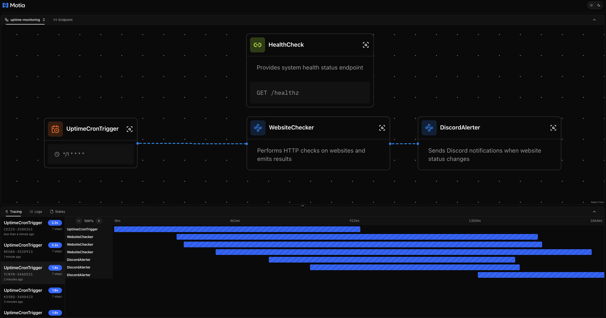
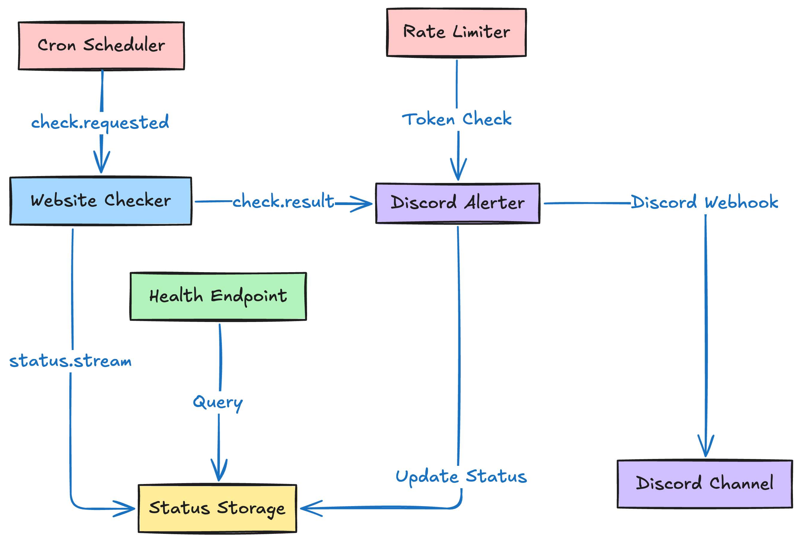

In today's modern era, website uptime is critical for business success. Whether you're monitoring a personal blog or enterprise applications, you need a reliable system that can detect outages, send alerts, and provide visibility into your site's health. Traditional monitoring solutions often involve complex infrastructure and vendor lock-in, but there's a better way.

This comprehensive guide explores how to build a production-ready uptime monitoring system using Motia's event-driven architecture. We'll cover:

1.  **Event-Driven Monitoring**: How Motia's `steps` create a scalable, maintainable monitoring pipeline.
2.  **Building the Architecture**: A detailed walkthrough of our five-component monitoring system.
3.  **Smart Alerting**: Implementing rate limiting and status change detection to prevent spam.

Let's build a monitoring system that actually works for you.

---

## The Power of Event-Driven Monitoring

<div className="my-8"></div>

At its core, our uptime monitoring system solves a fundamental challenge: how do you continuously monitor multiple websites without creating a brittle, monolithic application? Traditional monitoring tools often suffer from tight coupling, making them difficult to scale and customize. Our Motia-powered solution breaks this down into discrete, event-driven components that each handle a specific aspect of monitoring.

The magic happens through the integration of proven technologies and patterns:

-   **[Cron-Based Scheduling](https://en.wikipedia.org/wiki/Cron)**: Configurable check intervals using familiar cron expressions
-   **[Discord Webhooks](https://discord.com/developers/docs/resources/webhook)**: Instant notifications with rich formatting
-   **[Token Bucket Rate Limiting](https://en.wikipedia.org/wiki/Token_bucket)**: Intelligent alert throttling to prevent spam
-   **[Motia Framework](https://motia.dev)**: Event-driven orchestration with built-in observability

Instead of a monolithic monitoring daemon, we get a resilient architecture where each component can be scaled, modified, or replaced independently.

---

## The Anatomy of Our Monitoring System

Our application consists of five specialized steps, each handling a specific part of the monitoring workflow. Let's explore the complete architecture.

<Folder name="steps" defaultOpen>
  <File name="cron.step.js" />
  <File name="checker.step.js" />
  <File name="alerter.step.js" />
  <File name="health.step.js" />
</Folder>

<Folder name="lib" defaultOpen>
  <File name="env.js" />
  <File name="rate-limiter.js" />
  <File name="streams.js" />
</Folder>

<Tabs items={['cron', 'checker', 'alerter', 'health', 'utilities']}>
  <Tab value="cron">
    The heartbeat of our monitoring system. This cron-triggered step periodically emits check requests for all configured websites, acting as the central scheduler.

    ```js
    import { config as envConfig } from '../lib/env.js';

    export const config = {
      type: 'cron',
      name: 'UptimeCronTrigger',
      cron: envConfig.cron,
      emits: ['check.requested'],
      flows: ['uptime-monitoring']
    };

    export async function handler(context) {
      context.logger.info(`Starting uptime checks for ${envConfig.sites.length} sites`);
      context.logger.info(`Sites configured: ${JSON.stringify(envConfig.sites)}`);

      try {
        // Emit one check.requested event per configured site URL
        for (const url of envConfig.sites) {
          context.logger.info(`Scheduling check for: ${url}`);
          
          await context.emit({ 
            topic: 'check.requested', 
            data: { url: url } 
          });
          
          context.logger.info(`Successfully emitted for: ${url}`);
        }

        context.logger.info(`Successfully scheduled checks for all ${envConfig.sites.length} sites`);
      } catch (error) {
        context.logger.error('Error during cron execution:', error);
        throw error;
      }
    }
    ```

  </Tab>
  <Tab value="checker">
    The core monitoring component that performs HTTP checks on websites. It handles timeouts, errors, and response code analysis, then emits results for further processing.

    ```js
    import { z } from 'zod'

    export const config = {
      type: 'event',
      name: 'WebsiteChecker',
      description: 'Performs HTTP checks on websites and emits results',
      subscribes: ['check.requested'],
      emits: ['check.result', 'status.stream'],
      input: z.object({
        url: z.string().url('Must be a valid URL')
      }),
      flows: ['uptime-monitoring'],
    }

    export const handler = async (input, { logger, emit }) => {
      const { url } = input
      
      logger.info('Starting website check', { url })

      const startTime = performance.now()
      let result

      try {
        // Validate URL format before making request
        const urlObj = new URL(url)
        if (!['http:', 'https:'].includes(urlObj.protocol)) {
          throw new Error('Only HTTP and HTTPS protocols are supported')
        }

        // Perform HTTP request with timeout handling
        const controller = new AbortController()
        const timeoutId = setTimeout(() => controller.abort(), 10000) // 10 second timeout

        const response = await fetch(url, {
          method: 'GET',
          signal: controller.signal,
          headers: {
            'User-Agent': 'Motia-Uptime-Monitor/1.0',
            'Accept': '*/*',
            'Cache-Control': 'no-cache'
          },
          redirect: 'manual'
        })

        clearTimeout(timeoutId)
        const endTime = performance.now()
        const responseTime = Math.round(endTime - startTime)

        // Determine status: 2xx and 3xx as UP, everything else as DOWN
        const status = (response.status >= 200 && response.status < 400) ? 'UP' : 'DOWN'

        result = {
          url,
          status,
          code: response.status,
          responseTime,
          checkedAt: new Date().toISOString(),
          error: null
        }

        logger.info('Website check completed', {
          url,
          status,
          code: response.status,
          responseTime
        })

      } catch (error) {
        const endTime = performance.now()
        const responseTime = Math.round(endTime - startTime)

        let errorMessage = error.message

        // Handle specific error types with detailed messages
        if (error.name === 'AbortError') {
          errorMessage = 'Request timeout (10s)'
        } else if (error.name === 'TypeError' && error.message.includes('fetch')) {
          errorMessage = 'Network error - unable to connect'
        } else if (error.code === 'ENOTFOUND') {
          errorMessage = 'DNS resolution failed'
        } else if (error.code === 'ECONNREFUSED') {
          errorMessage = 'Connection refused'
        }

        result = {
          url,
          status: 'DOWN',
          code: null,
          responseTime,
          checkedAt: new Date().toISOString(),
          error: errorMessage
        }

        logger.error('Website check failed', {
          url,
          error: errorMessage,
          responseTime,
          originalError: error.code || error.name
        })
      }

      // Emit results to both alerter and dashboard
      await emit({ topic: 'check.result', data: result })
      await emit({ topic: 'status.stream', data: result })

      logger.info('Check results emitted successfully', { url, status: result.status })
    }
    ```

  </Tab>
  <Tab value="alerter">
    The intelligent alerting system that detects status changes, applies rate limiting, and sends Discord notifications. Only triggers alerts when status actually changes, preventing noise.

    ```js
    import { z } from 'zod'
    import { getPreviousStatus } from '../lib/streams.js'
    import { createRateLimiter } from '../lib/rate-limiter.js'
    import { config as envConfig } from '../lib/env.js'

    // Create a rate limiter instance for Discord alerts
    const rateLimiter = createRateLimiter({
      burst: envConfig.alertBurst,
      windowSec: envConfig.alertWindowSec
    })

    export const config = {
      type: 'event',
      name: 'DiscordAlerter',
      description: 'Sends Discord notifications when website status changes',
      subscribes: ['check.result'],
      emits: [],
      input: z.object({
        url: z.string().url(),
        status: z.enum(['UP', 'DOWN']),
        code: z.number().nullable(),
        responseTime: z.number(),
        checkedAt: z.string(),
        error: z.string().nullable()
      }),
      flows: ['uptime-monitoring'],
    }

    function createDiscordMessage(result, previousStatus) {
      const { url, status, code, responseTime, checkedAt, error } = result

      const isUp = status === 'UP'
      const emoji = isUp ? '🟢' : '🔴'
      const color = isUp ? 0x00ff00 : 0xff0000

      const content = `${emoji} ${url} is ${status}${code ? ` (${code})` : ''}`

      const fields = [
        {
          name: 'Response Time',
          value: `${responseTime}ms`,
          inline: true
        }
      ]

      if (code !== null) {
        fields.push({
          name: 'Status Code',
          value: code.toString(),
          inline: true
        })
      }

      if (error) {
        fields.push({
          name: 'Error',
          value: error,
          inline: false
        })
      }

      fields.push({
        name: 'Previous Status',
        value: previousStatus,
        inline: true
      })

      return {
        content,
        embeds: [{
          title: `Website Status Change: ${status}`,
          description: `${url} changed from ${previousStatus} to ${status}`,
          color,
          timestamp: checkedAt,
          fields
        }]
      }
    }

    export const handler = async (input, { logger }) => {
      const { url, status } = input

      // Get the previous status for comparison
      const previousResult = getPreviousStatus(url)

      // Handle first-time checks
      if (!previousResult) {
        logger.info('First-time check for site, no alert needed', { url, status })
        const { updateLastStatus } = await import('../lib/streams.js')
        updateLastStatus(input)
        return
      }

      const previousStatus = previousResult.status

      // Only trigger alerts when status actually changes
      if (status === previousStatus) {
        logger.debug('Status unchanged, no alert needed', { url, status, previousStatus })
        const { updateLastStatus } = await import('../lib/streams.js')
        updateLastStatus(input)
        return
      }

      // Status has changed - check rate limiting
      logger.info('Status change detected', {
        url,
        previousStatus,
        newStatus: status,
        transition: `${previousStatus} → ${status}`
      })

      if (!rateLimiter.consume(url)) {
        const timeUntilNext = rateLimiter.getTimeUntilNextToken(url)
        logger.warn('Alert rate limited', {
          url,
          status,
          previousStatus,
          timeUntilNextMs: timeUntilNext,
          tokensRemaining: rateLimiter.getTokenCount(url)
        })
        return
      }

      // Send Discord notification
      const message = createDiscordMessage(input, previousStatus)
      
      try {
        const response = await fetch(envConfig.discordWebhook, {
          method: 'POST',
          headers: {
            'Content-Type': 'application/json',
            'User-Agent': 'Motia-Uptime-Monitor/1.0'
          },
          body: JSON.stringify(message)
        })

        if (response.ok) {
          logger.info('Discord alert sent successfully', { url, status, previousStatus })
        } else {
          const errorText = await response.text().catch(() => 'Unknown error')
          logger.error('Discord webhook failed', {
            status: response.status,
            error: errorText
          })
        }
      } catch (error) {
        logger.error('Failed to send Discord webhook', {
          error: error.message
        })
      }

      // Update status store after sending alert
      const { updateLastStatus } = await import('../lib/streams.js')
      updateLastStatus(input)
    }
    ```

  </Tab>
  <Tab value="health">
    A health check endpoint that provides system status and monitoring metrics. Essential for monitoring the monitor itself and integrating with external health check services.

    ```js
    import { z } from 'zod'
    import { getSnapshot } from '../lib/streams.js'
    import { config as envConfig } from '../lib/env.js'

    export const config = {
      type: 'api',
      name: 'HealthCheck',
      description: 'Provides system health status endpoint',
      method: 'GET',
      path: '/healthz',
      emits: [],
      responseSchema: {
        200: z.object({
          status: z.literal('ok'),
          sitesConfigured: z.number(),
          lastKnown: z.record(z.any()),
          now: z.string()
        })
      },
      flows: ['uptime-monitoring'],
    }

    export const handler = async (_, { logger }) => {
      logger.info('Health check endpoint accessed')
      
      try {
        const now = new Date().toISOString()
        const sitesConfigured = envConfig.sites.length
        const lastKnown = getSnapshot()
        
        const response = {
          status: 'ok',
          sitesConfigured,
          lastKnown,
          now
        }
        
        logger.info('Health check completed successfully', { 
          sitesConfigured,
          sitesWithStatus: Object.keys(lastKnown).length
        })
        
        return {
          status: 200,
          body: response
        }
        
      } catch (error) {
        logger.error('Health check failed', { 
          error: error.message,
          stack: error.stack
        })
        
        return {
          status: 200,
          body: {
            status: 'ok',
            sitesConfigured: 0,
            lastKnown: {},
            now: new Date().toISOString(),
            error: error.message
          }
        }
      }
    }
    ```

  </Tab>
  <Tab value="utilities">
    Three essential utility libraries that power the monitoring system: environment validation, rate limiting, and persistent status storage.

    **Environment Configuration (`lib/env.js`)**
    ```js
    // Validates Discord webhook URLs
    function isValidDiscordWebhook(url) {
      if (!url || typeof url !== 'string') return false;
      
      try {
        const parsed = new URL(url);
        return parsed.hostname === 'discord.com' || parsed.hostname === 'discordapp.com';
      } catch {
        return false;
      }
    }

    // Parses and validates the SITES environment variable
    function parseSites(sitesJson) {
      if (!sitesJson) {
        throw new Error('SITES environment variable is required');
      }

      let sites;
      try {
        sites = JSON.parse(sitesJson);
      } catch (error) {
        throw new Error(`Invalid SITES JSON format: ${error.message}`);
      }

      if (!Array.isArray(sites) || sites.length === 0) {
        throw new Error('SITES must be a non-empty JSON array of URLs');
      }

      // Validate each URL
      sites.forEach(site => {
        if (typeof site !== 'string') {
          throw new Error(`Invalid site URL: ${site} (must be string)`);
        }
        try {
          new URL(site);
        } catch {
          throw new Error(`Invalid site URL format: ${site}`);
        }
      });

      return sites;
    }

    export const config = {
      discordWebhook: process.env.DISCORD_WEBHOOK,
      sites: parseSites(process.env.SITES),
      cron: process.env.CHECK_INTERVAL_CRON || '*/1 * * * *',
      alertBurst: parseInt(process.env.ALERT_BURST) || 3,
      alertWindowSec: parseInt(process.env.ALERT_WINDOW_SEC) || 300
    };
    ```

    **Rate Limiter (`lib/rate-limiter.js`)**
    ```js
    // Token bucket rate limiter with per-site isolation
    export function createRateLimiter({ burst, windowSec }) {
      const buckets = new Map()
      const refillRate = burst / (windowSec * 1000)

      function consume(siteUrl) {
        const bucket = getBucket(siteUrl)
        refillBucket(bucket)
        
        if (bucket.tokens >= 1) {
          bucket.tokens -= 1
          return true
        }
        
        return false
      }

      function getBucket(siteUrl) {
        if (!buckets.has(siteUrl)) {
          buckets.set(siteUrl, {
            tokens: burst,
            lastRefill: Date.now()
          })
        }
        return buckets.get(siteUrl)
      }

      function refillBucket(bucket) {
        const now = Date.now()
        const timePassed = now - bucket.lastRefill
        
        if (timePassed > 0) {
          const tokensToAdd = timePassed * refillRate
          bucket.tokens = Math.min(burst, bucket.tokens + tokensToAdd)
          bucket.lastRefill = now
        }
      }

      return { consume, /* other methods */ }
    }
    ```

    **Status Storage (`lib/streams.js`)**
    ```js
    // File-based persistent storage for site status
    import { readFileSync, writeFileSync, existsSync } from 'fs'

    const STORE_FILE = join(process.cwd(), '.motia', 'status-store.json')

    export function updateLastStatus(result) {
      // Validate input
      if (!result?.url || !['UP', 'DOWN'].includes(result.status)) {
        throw new Error('Invalid result object')
      }

      const store = loadStatusStore()
      store[result.url] = { ...result }
      saveStatusStore(store)
    }

    export function getPreviousStatus(url) {
      const store = loadStatusStore()
      const result = store[url]
      return result ? { ...result } : null
    }

    export function getSnapshot() {
      const store = loadStatusStore()
      const snapshot = {}
      
      for (const [url, result] of Object.entries(store)) {
        snapshot[url] = { ...result }
      }
      
      return snapshot
    }
    ```

  </Tab>
</Tabs>

---

## Explore the Workbench

The Motia Workbench provides a visual representation of your monitoring pipeline, making it easy to understand the event flow and debug issues in real-time.

<div className="my-8"></div>

You can monitor real-time status checks, view Discord alert logs, and trace the execution of each step directly in the Workbench interface. This makes development and debugging significantly easier compared to traditional monitoring solutions.

---

## Key Features & Benefits

### ⚡ **Event-Driven Architecture**
Each component is independent and communicates through events, making the system highly scalable and maintainable.

### 🎯 **Smart Status Detection**  
Only triggers alerts when status actually changes (UP ↔ DOWN), eliminating noise from temporary fluctuations.

### 🚨 **Intelligent Rate Limiting**
Token bucket algorithm prevents alert spam during site flapping while ensuring critical alerts get through.

### 📊 **Built-in Observability**
Comprehensive logging, health checks, and real-time status tracking with persistent storage.

### 🔧 **Production-Ready**
Robust error handling, timeout management, and configurable check intervals ensure reliability.

### 🎨 **Rich Discord Alerts**
Beautiful embedded messages with response times, error details, and status transitions.

---

## Data Flow & Event Architecture



### Event Flow
1. **Cron Trigger** → Emits `check.requested` events for each configured site
2. **Website Checker** → Receives `check.requested`, performs HTTP check
3. **Status Update** → Checker emits `check.result` with result
4. **Alert Processing** → Alerter receives `check.result`, detects status changes
5. **Discord Notification** → Alerter sends webhook if status changed and rate limit allows
6. **Status Storage** → Status is persisted for health endpoint and future comparisons

---

## Trying It Out

Ready to build your own production-ready monitoring system? Let's get it running.

<Steps>

### Install Dependencies

Install the necessary npm packages and set up the development environment.

```shell
npm install
```

### Configure Environment Variables

Create a `.env` file with your monitoring configuration. You'll need a Discord webhook URL and the sites you want to monitor.

```shell
# Required: Discord webhook for alerts
DISCORD_WEBHOOK="https://discord.com/api/webhooks/123456789/your-webhook-token"

# Required: JSON array of URLs to monitor
SITES='["https://example.com", "https://api.yourdomain.com", "https://blog.yoursite.org"]'

# Optional: Check frequency (default: every minute)
CHECK_INTERVAL_CRON="*/1 * * * *"

# Optional: Rate limiting (default: 3 alerts per 5 minutes)
ALERT_BURST="3"
ALERT_WINDOW_SEC="300"
```

### Set Up Discord Webhook

Create a Discord webhook to receive alerts:

1. Go to your Discord server settings
2. Navigate to **Integrations** → **Webhooks**
3. Click **New Webhook**
4. Copy the webhook URL and add it to your `.env` file

### Run the Monitoring System

Start the Motia development server to begin monitoring your websites.

```shell
npm run dev
```

### Check System Health

Verify your monitoring system is working correctly:

```shell
curl http://localhost:3000/healthz
```

You should see a response with your configured sites and their current status:

```json
{
  "status": "ok",
  "sitesConfigured": 3,
  "lastKnown": {
    "https://example.com": {
      "url": "https://example.com",
      "status": "UP",
      "code": 200,
      "responseTime": 245,
      "checkedAt": "2024-01-15T10:30:00.000Z",
      "error": null
    }
  },
  "now": "2024-01-15T10:35:00.000Z"
}
```

### Monitor the Logs

Watch the logs to see your monitoring system in action:

- **Cron triggers**: Check scheduling for all configured sites
- **Website checks**: HTTP requests and response analysis  
- **Status changes**: UP/DOWN transitions and Discord alerts
- **Rate limiting**: Alert suppression during site flapping

</Steps>

---

## Advanced Configuration

### Custom Check Intervals

Modify the cron expression to change monitoring frequency:

```shell
# Every 5 minutes
CHECK_INTERVAL_CRON="*/5 * * * *"

# Every hour
CHECK_INTERVAL_CRON="0 * * * *"

# Every 6 hours
CHECK_INTERVAL_CRON="0 */6 * * *"

# Business hours only (9 AM - 5 PM, Mon-Fri)
CHECK_INTERVAL_CRON="* 9-17 * * 1-5"
```

### Alert Rate Limiting

Fine-tune the rate limiting to match your needs:

```shell
# Very strict: 1 alert per 10 minutes
ALERT_BURST="1"
ALERT_WINDOW_SEC="600"

# More permissive: 5 alerts per 2 minutes
ALERT_BURST="5"  
ALERT_WINDOW_SEC="120"
```

### Multi-Environment Monitoring

Set up different monitoring configurations for different environments:

```shell
# Production sites
SITES='["https://app.production.com", "https://api.production.com"]'

# Staging sites  
SITES='["https://app.staging.com", "https://api.staging.com"]'

# Development sites
SITES='["https://app.dev.com", "http://localhost:8080"]'
```

### Custom Discord Alert Formatting

Modify the `createDiscordMessage` function in `alerter.step.js` to customize alert appearance:

```js
function createDiscordMessage(result, previousStatus) {
  const { url, status, code, responseTime } = result
  
  // Custom colors for your brand
  const color = status === 'UP' ? 0x2ecc71 : 0xe74c3c
  
  // Custom emoji and formatting
  const emoji = status === 'UP' ? '✅' : '❌'
  const urgency = responseTime > 5000 ? '🐌 SLOW' : '⚡ FAST'
  
  return {
    content: `${emoji} **${url}** is ${status}`,
    embeds: [{
      title: `${urgency} Website ${status}`,
      description: `**${url}** changed from ${previousStatus} to ${status}`,
      color,
      timestamp: result.checkedAt,
      fields: [
        {
          name: '⏱️ Response Time',
          value: `${responseTime}ms`,
          inline: true
        },
        {
          name: '📊 Status Code', 
          value: code?.toString() || 'N/A',
          inline: true
        }
      ]
    }]
  }
}
```

---

## Troubleshooting

### Common Issues

**Sites not being checked:**
- Verify `SITES` environment variable is valid JSON
- Check cron expression syntax using [crontab.guru](https://crontab.guru)
- Review logs for parsing errors

**Discord alerts not working:**
- Verify `DISCORD_WEBHOOK` URL is correct
- Test webhook manually: `curl -X POST $DISCORD_WEBHOOK -H "Content-Type: application/json" -d '{"content":"Test message"}'`
- Check Discord webhook permissions

**High memory usage:**
- Monitor status store size with health endpoint
- Consider implementing status history cleanup
- Reduce check frequency for many sites

**False positive alerts:**
- Increase timeout values in checker step
- Implement retry logic before marking as DOWN
- Adjust rate limiting to reduce noise

### Performance Tips

- **Large Site Lists**: Consider sharding across multiple instances
- **Slow Sites**: Implement custom timeout values per site
- **High Frequency**: Use Redis for status storage instead of file system
- **Alert Fatigue**: Implement escalation policies and alert grouping

### Monitoring the Monitor

Set up monitoring for your monitoring system:

```shell
# Monitor the health endpoint itself
curl -f http://localhost:3000/healthz || echo "Monitor is down!"

# Check for recent status updates
curl http://localhost:3000/healthz | jq '.lastKnown | to_entries | map(select(.value.checkedAt > (now - 300)))'

# Verify all sites are being checked
curl http://localhost:3000/healthz | jq '.sitesConfigured == (.lastKnown | length)'
```

---

## 💻 Dive into the Code

Want to explore the complete monitoring implementation? Check out the full source code, including all steps, utilities, and configuration examples:

<div className="not-prose">
  <div className="bg-gradient-to-r from-green-50 to-emerald-50 border border-green-200 rounded-lg p-6 my-6">
    <div className="flex items-start space-x-4">
      <div className="flex-shrink-0">
        <svg className="w-8 h-8 text-green-600" fill="currentColor" viewBox="0 0 20 20">
          <path fillRule="evenodd" d="M12.316 3.051a1 1 0 01.633 1.265l-4 12a1 1 0 11-1.898-.632l4-12a1 1 0 011.265-.633zM5.707 6.293a1 1 0 010 1.414L3.414 10l2.293 2.293a1 1 0 11-1.414 1.414l-3-3a1 1 0 010-1.414l3-3a1 1 0 011.414 0zm8.586 0a1 1 0 011.414 0l3 3a1 1 0 010 1.414l-3 3a1 1 0 11-1.414-1.414L16.586 10l-2.293-2.293a1 1 0 010-1.414z" clipRule="evenodd" />
        </svg>
      </div>
      <div className="flex-1">
        <h3 className="text-lg font-semibold text-gray-900 mb-2">Complete Uptime Monitor</h3>
        <p className="text-gray-600 mb-4">Access the full implementation with event steps, utility libraries, Discord integration, and production-ready configuration.</p>
        <div className="flex flex-col sm:flex-row gap-3">
          <a 
            href="https://github.com/MotiaDev/motia-examples/tree/main/examples/motia-uptime-monitor" 
            target="_blank" 
            rel="noopener noreferrer"
            className="inline-flex items-center px-4 py-2 bg-green-600 hover:bg-green-700 text-white font-medium rounded-md transition-colors duration-200"
          >
            <svg className="w-4 h-4 mr-2" fill="currentColor" viewBox="0 0 24 24">
              <path d="M12 0C5.374 0 0 5.373 0 12 0 17.302 3.438 21.8 8.207 23.387c.599.111.793-.261.793-.577v-2.234c-3.338.726-4.033-1.416-4.033-1.416-.546-1.387-1.333-1.756-1.333-1.756-1.089-.745.083-.729.083-.729 1.205.084 1.839 1.237 1.839 1.237 1.07 1.834 2.807 1.304 3.492.997.107-.775.418-1.305.762-1.604-2.665-.305-5.467-1.334-5.467-5.931 0-1.311.469-2.381 1.236-3.221-.124-.303-.535-1.524.117-3.176 0 0 1.008-.322 3.301 1.23A11.509 11.509 0 0112 5.803c1.02.005 2.047.138 3.006.404 2.291-1.552 3.297-1.23 3.297-1.23.653 1.653.242 2.874.118 3.176.77.84 1.235 1.911 1.235 3.221 0 4.609-2.807 5.624-5.479 5.921.43.372.823 1.102.823 2.222v3.293c0 .319.192.694.801.576C20.566 21.797 24 17.3 24 12c0-6.627-5.373-12-12-12z"/>
            </svg>
            View Monitor Example
          </a>
          <a 
            href="https://github.com/MotiaDev/motia-examples" 
            target="_blank" 
            rel="noopener noreferrer"
            className="inline-flex items-center px-4 py-2 bg-gray-100 hover:bg-gray-200 text-gray-800 font-medium rounded-md transition-colors duration-200"
          >
            More Examples →
          </a>
        </div>
      </div>
    </div>
  </div>
</div>

---

## Conclusion: Monitoring That Actually Works

This uptime monitoring system demonstrates the power of event-driven architecture for infrastructure monitoring. By breaking down monitoring into discrete, specialized components, we've created a system that's not only reliable but also extensible and maintainable.

The event-driven approach means you can easily:
- **Add new notification channels** (Slack, PagerDuty, email) by creating new steps
- **Implement custom health checks** (database connectivity, API endpoints, SSL certificates)
- **Scale monitoring** across multiple regions or environments
- **Integrate with existing systems** without disrupting the core monitoring loop

Key architectural benefits:
- **Resilience**: Component failures don't bring down the entire system
- **Observability**: Built-in logging and tracing at every step
- **Flexibility**: Easy to modify check intervals, alert logic, or add new features
- **Testing**: Each component can be tested in isolation

From here, you can extend the system by:
- Adding support for different check types (TCP, database, custom health endpoints)
- Implementing escalation policies and on-call rotations
- Building a web dashboard for historical data and trends
- Adding integration with incident management systems
- Implementing multi-region monitoring with failover

The event-driven architecture makes all of these extensions straightforward to implement without disrupting the existing monitoring pipeline.

Ready to build monitoring infrastructure that scales with your business? Start building with Motia today!
